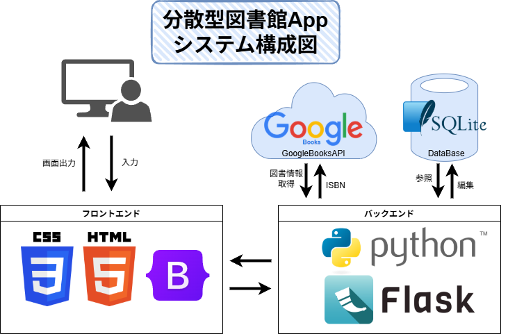
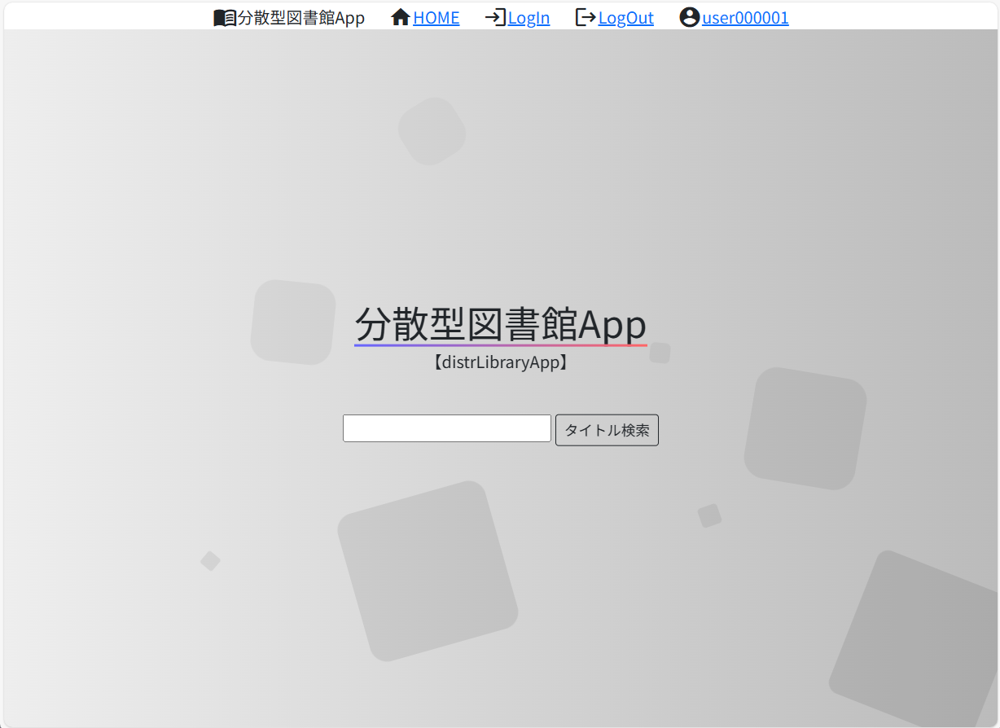
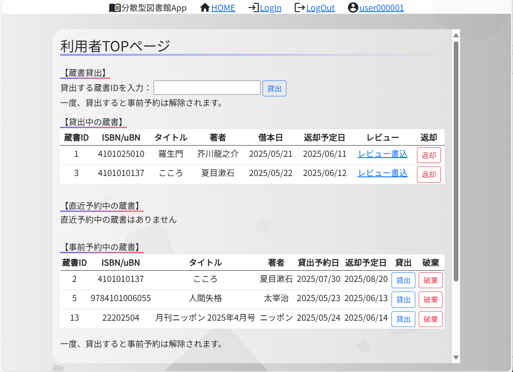
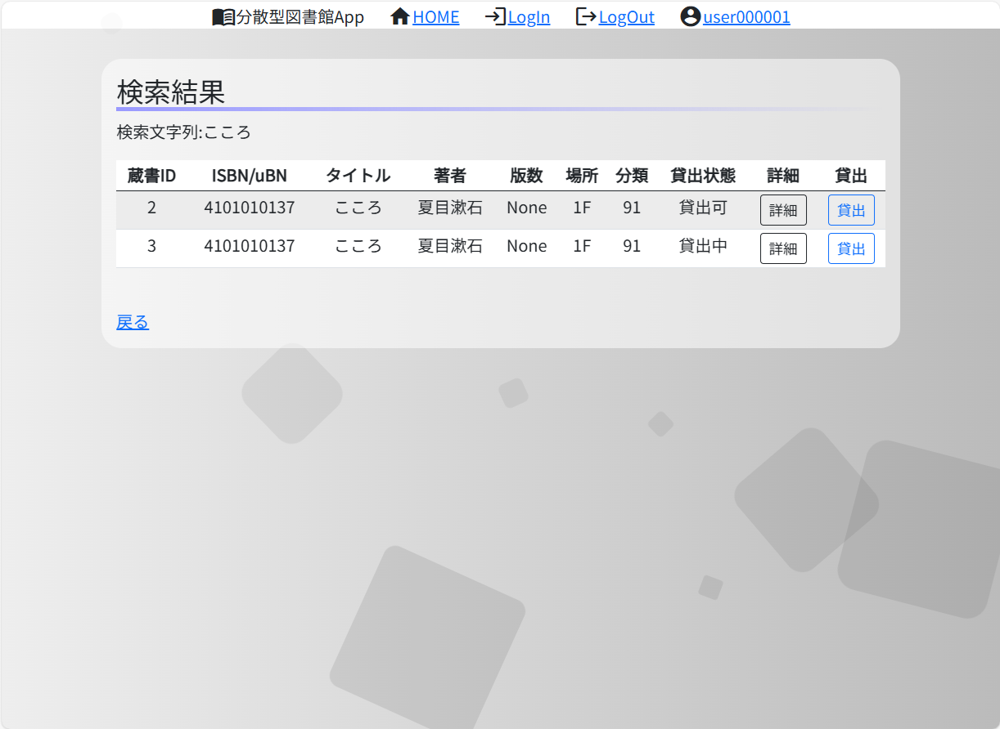
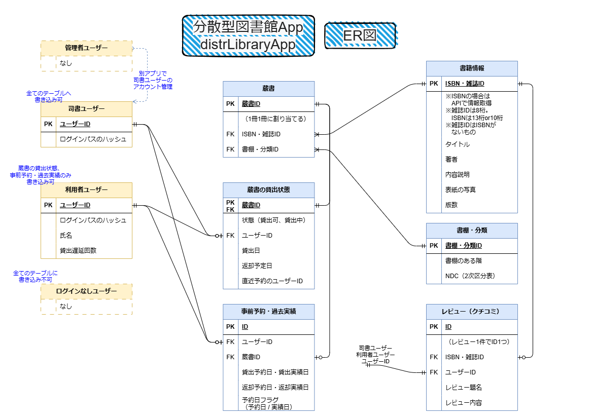
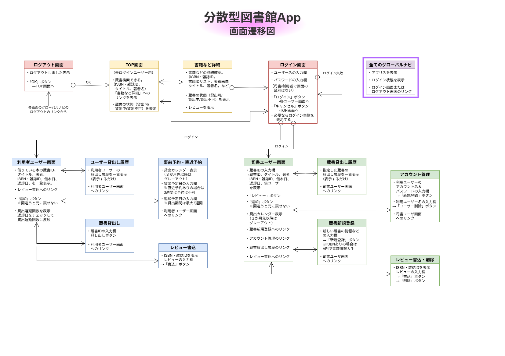

## 分散型図書館App [distrLibraryApp]

Python Flaskの勉強のために作成したWebアプリです。

蔵書の検索・ログイン・貸出・返却・貸出予約などの機能があります。

| 種類  | ユーザー名 | 初期パスワード |
| ----- | --------- | --  |
| 利用者 | user000001 | abc1 |
| 利用者 | user000002 | abc2 |
| 司書 | lib0000001 | abc1 |
| 司書 | lib0000002 | abc2 |

